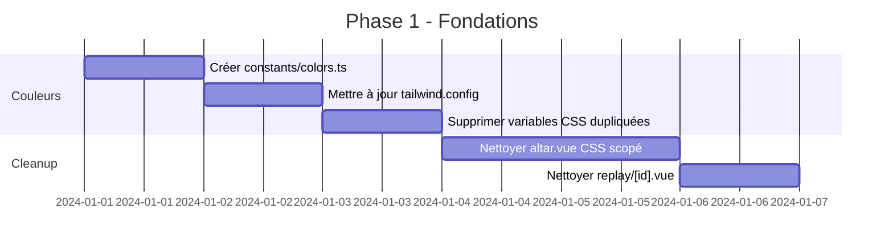

# 🔍 Audit Complet - Le Collecteur de Dose

> **Date de l'audit**: 11 Décembre 2025  
> **Version Nuxt**: 3.x  
> **Technologies principales**: Nuxt.js, Vue.js, Tailwind CSS, GSAP, Supabase

---

## 📋 Table des matières

1. [Résumé Exécutif](#-résumé-exécutif)
2. [Design System & Couleurs](#-design-system--couleurs)
3. [CSS & Tailwind](#-css--tailwind)
4. [Architecture des Composants](#-architecture-des-composants)
5. [Composables & Logique Réutilisable](#-composables--logique-réutilisable)
6. [Duplication de Code](#-duplication-de-code)
7. [Recommandations Prioritaires](#-recommandations-prioritaires)
8. [Plan d'Action](#-plan-daction)

---

## 📊 Résumé Exécutif

### Points Forts ✅

- **Architecture des composables bien pensée** : Les composables (`useAltarEffects`, `useCardGrouping`, etc.) encapsulent correctement la logique réutilisable
- **Types TypeScript bien définis** : Le typage est cohérent et bien structuré dans `/types/`
- **Centralisation des constantes d'animation** : Le fichier `constants/timing.ts` est un excellent exemple de centralisation
- **Système de configuration Vaal Outcome** : `types/vaalOutcome.ts` est bien structuré et extensible

### Points Critiques ⚠️

- **Duplication massive de CSS** entre fichiers globaux et composants scopés
- **Couleurs définies à plusieurs endroits** créant des incohérences potentielles
- **Sous-utilisation de Tailwind CSS** pour le layout et le positionnement
- **CSS classique (flex, padding, etc.)** alors que Tailwind devrait être utilisé

---

## 🎨 Design System & Couleurs

### Problème Majeur: Sources Multiples de Vérité

Les couleurs sont actuellement définies à **5 endroits différents**, créant un risque d'incohérence:

#### 1. `tailwind.config.ts` (Source principale attendue)

```typescript
// Définition des couleurs tier
tier: {
  t0: { DEFAULT: '#c9a227', glow: 'rgba(201, 162, 39, 0.4)', ... },
  t1: { DEFAULT: '#7a6a8a', glow: 'rgba(122, 106, 138, 0.35)', ... },
  // ...
}
```

#### 2. `assets/css/main.css` (Duplication ❌)

```css
:root {
  --color-accent: #c97a3a;
  --color-accent-light: #e8a060;
  /* Couleurs dupliquées en CSS custom properties */
}
```

#### 3. `types/card.ts` (Duplication ❌)

```typescript
export const TIER_CONFIG: Record<CardTier, TierConfig> = {
  T0: { color: '#6d5a2a', glowColor: '#c9a227', ... },
  // Couleurs différentes de tailwind.config.ts!
}
```

#### 4. `assets/css/cards.css` (Duplication ❌)

```css
.game-card--t0 {
  --tier-color: #c9a227;
  --tier-glow: rgba(201, 162, 39, 0.6);
  /* Valeurs similaires mais pas identiques */
}
```

#### 5. Composables (`useAltarAura.ts`, `useVaalOutcomes.ts`)

```typescript
const TIER_COLORS = {
  T0: { primary: '#c9a227', secondary: '#f5d76e', ... },
  // Encore une autre définition!
}
```

### 🔧 Recommandation: Source Unique

**Créer un fichier centralisé `constants/colors.ts`:**

```typescript
// constants/colors.ts
export const COLORS = {
  tiers: {
    T0: {
      primary: "#c9a227",
      secondary: "#f5d76e",
      glow: "rgba(201, 162, 39, 0.6)",
      bg: "rgba(109, 90, 42, 0.4)",
    },
    T1: {
      /* ... */
    },
    T2: {
      /* ... */
    },
    T3: {
      /* ... */
    },
  },
  accent: {
    DEFAULT: "#c97a3a",
    light: "#e8a060",
    dark: "#a05520",
  },
  vaal: {
    primary: "#c83232",
    secondary: "#ff6b6b",
    glow: "rgba(200, 50, 50, 0.7)",
  },
} as const;

// Export pour Tailwind
export const tailwindColors = {
  tier: Object.fromEntries(
    Object.entries(COLORS.tiers).map(([key, val]) => [
      key.toLowerCase(),
      { DEFAULT: val.primary, glow: val.glow, bg: val.bg },
    ])
  ),
};
```

Puis dans `tailwind.config.ts`:

```typescript
import { tailwindColors } from "./constants/colors";

export default {
  theme: {
    extend: {
      colors: tailwindColors,
    },
  },
};
```

---

## 🎯 CSS & Tailwind

### Sous-utilisation Critique de Tailwind

De nombreux composants utilisent du CSS classique au lieu de Tailwind pour des propriétés basiques:

### Exemples à Corriger

#### `RunicButton.vue` - Layout avec CSS classique

```css
/* ❌ Actuel */
.runic-button {
  display: inline-flex;
  align-items: center;
  justify-content: center;
  gap: 0.5rem;
  padding: 0.75rem 1.5rem;
  font-family: "Cinzel", serif;
}
```

```vue
<!-- ✅ Recommandé -->
<button
  class="inline-flex items-center justify-center gap-2 px-6 py-3 font-display"
  :class="[variantClasses, sizeClasses]"
>
```

#### `CardStack.vue` - Positionnement

```css
/* ❌ Actuel */
.card-stack-container {
  position: relative;
}
.card-stack {
  position: relative;
  display: inline-block;
}
```

```vue
<!-- ✅ Recommandé -->
<div class="relative">
  <div class="relative inline-block">
```

#### `RunicHeader.vue` - Padding et margin

```css
/* ❌ Actuel */
.runic-header {
  position: relative;
  padding: 1.25rem 1.5rem 1rem;
}
```

```vue
<!-- ✅ Recommandé -->
<div class="relative px-6 pt-5 pb-4 sm:px-8 sm:pt-6 sm:pb-5">
```

### CSS Custom Justifié vs À Convertir

#### ✅ CSS Custom Justifié (garder):

- Effets foil complexes avec `repeating-linear-gradient`
- Animations `@keyframes` personnalisées
- Box-shadows multiples pour effets de pierre gravée
- Effets 3D avec `transform-style: preserve-3d`
- Pseudo-éléments décoratifs (::before, ::after)

#### ❌ À Convertir en Tailwind:

| Propriété CSS             | Classe Tailwind  |
| ------------------------- | ---------------- |
| `display: flex`           | `flex`           |
| `align-items: center`     | `items-center`   |
| `justify-content: center` | `justify-center` |
| `gap: 0.5rem`             | `gap-2`          |
| `padding: 1rem`           | `p-4`            |
| `margin-bottom: 1rem`     | `mb-4`           |
| `position: relative`      | `relative`       |
| `position: absolute`      | `absolute`       |
| `font-size: 0.875rem`     | `text-sm`        |
| `font-weight: 600`        | `font-semibold`  |
| `border-radius: 8px`      | `rounded-lg`     |

### Fichiers CSS Globaux à Refactorer

| Fichier            | Problèmes identifiés                                    |
| ------------------ | ------------------------------------------------------- |
| `main.css`         | Couleurs dupliquées dans `:root`, layout basique en CSS |
| `cards.css`        | Variables tier dupliquées, layout en CSS classique      |
| `altar.css`        | Énorme fichier avec beaucoup de duplication             |
| `foil.css`         | ✅ OK - Effets visuels complexes justifiés              |
| `foil-effects.css` | ✅ OK - Effets visuels complexes justifiés              |

---

## 🏗️ Architecture des Composants

### Composants UI - État Actuel

| Composant               | Design System | Tailwind  | Duplication CSS          |
| ----------------------- | ------------- | --------- | ------------------------ |
| `RunicButton.vue`       | ⚠️ Partiel    | ❌ Faible | Non                      |
| `RunicBox.vue`          | ⚠️ Partiel    | ❌ Faible | Non                      |
| `RunicSelect.vue`       | ⚠️ Partiel    | ❌ Faible | Non                      |
| `RunicInput.vue`        | ⚠️ Partiel    | ❌ Faible | Non                      |
| `RunicRadio.vue`        | ⚠️ Partiel    | ❌ Faible | Non                      |
| `RunicHeader.vue`       | ⚠️ Partiel    | ❌ Faible | Non                      |
| `RunicNumber.vue`       | ⚠️ Partiel    | ❌ Faible | Non                      |
| `RunicStats.vue`        | ✅ Bon        | ⚠️ Moyen  | Non                      |
| `GameCard.vue`          | ⚠️ Partiel    | ❌ Faible | **Oui** (avec cards.css) |
| `CardStack.vue`         | ✅ Bon        | ⚠️ Moyen  | Non                      |
| `CardGrid.vue`          | ✅ Bon        | ⚠️ Moyen  | Non                      |
| `ActivityLogsPanel.vue` | ⚠️ Partiel    | ❌ Faible | Non                      |

### Composants Manquants à Créer

#### 1. `RunicModal.vue` - Factorisation des modals

`LegalModal.vue` et `SettingsModal.vue` partagent ~80% de structure CSS identique. Créer un composant de base:

```vue
<!-- components/ui/RunicModal.vue -->
<template>
  <Teleport to="body">
    <Transition name="modal">
      <div v-if="modelValue" class="runic-modal">
        <div
          class="runic-modal__overlay"
          @click="$emit('update:modelValue', false)"
        />
        <div class="runic-modal__content">
          <div class="runic-modal__header">
            <h2 class="runic-modal__title">
              <span class="runic-modal__rune">{{ icon }}</span>
              {{ title }}
              <span class="runic-modal__rune">{{ icon }}</span>
            </h2>
            <button
              class="runic-modal__close"
              @click="$emit('update:modelValue', false)"
            >
              <!-- SVG close -->
            </button>
          </div>
          <div class="runic-modal__body">
            <slot />
          </div>
          <div v-if="$slots.footer" class="runic-modal__footer">
            <slot name="footer" />
          </div>
        </div>
      </div>
    </Transition>
  </Teleport>
</template>
```

#### 2. `RunicIcon.vue` - Centralisation des icônes

Les SVG sont actuellement inline dans plusieurs composants. Créer:

```vue
<!-- components/ui/RunicIcon.vue -->
<script setup lang="ts">
const props = defineProps<{
  name:
    | "close"
    | "play"
    | "search"
    | "filter"
    | "twitch"
    | "youtube"
    | "logout"
    | "users";
  size?: "sm" | "md" | "lg";
}>();

const icons = {
  close: "<path ... />",
  play: "<path ... />",
  // ...
};
</script>
```

#### 3. `RunicDivider.vue` - Séparateur réutilisable

```vue
<!-- components/ui/RunicDivider.vue -->
<template>
  <div class="runic-divider">
    <span class="runic-divider__rune">◆</span>
  </div>
</template>
```

### Pages avec CSS Scopé Problématique

#### `pages/altar.vue` - Duplication Massive

**~500 lignes de CSS scopé** qui dupliquent `assets/css/altar.css`:

- `.altar-platform` et ses variantes tier
- Animations `@keyframes` identiques (foilGlowSubtle, vaalGlowPulse, etc.)
- Styles de `.prefs-modal` et `.share-panel`

**Solution**:

1. Garder uniquement les styles spécifiques à la page
2. Utiliser les classes globales de `altar.css`
3. Ajouter des classes Tailwind pour le layout

#### `pages/replay/[id].vue` - Même Problème

Duplique également les styles d'altar avec des variations mineures.

---

## 🔄 Composables & Logique Réutilisable

### État Actuel - Bien Structuré ✅

| Composable                | Rôle                               | Qualité      |
| ------------------------- | ---------------------------------- | ------------ |
| `useActivityLogs`         | Gestion realtime des logs Supabase | ✅ Excellent |
| `useAltarAura`            | Effets visuels d'aura              | ✅ Bon       |
| `useAltarEffects`         | Heartbeat & earthquake             | ✅ Bon       |
| `useCardGrouping`         | Groupement par variation           | ✅ Excellent |
| `useCardSorting`          | Tri des cartes                     | ✅ Excellent |
| `useDisintegrationEffect` | Effet de destruction               | ✅ Bon       |
| `useFoilEffect`           | Gestion effet foil                 | ✅ Bon       |
| `usePersistedFilter`      | Persistence sessionStorage         | ✅ Excellent |
| `useReplayPlayer`         | Lecture des replays                | ✅ Bon       |
| `useReplayRecorder`       | Enregistrement replays             | ✅ Bon       |
| `useVaalOutcomes`         | Animations des outcomes            | ✅ Bon       |

### Améliorations Suggérées

#### 1. Centraliser TIER_COLORS dans un composable

```typescript
// composables/useTierColors.ts
import { COLORS } from "~/constants/colors";

export function useTierColors() {
  const getTierColor = (tier: CardTier) => COLORS.tiers[tier];
  const getTierGlow = (tier: CardTier) => COLORS.tiers[tier].glow;
  const getTierCSS = (tier: CardTier) => ({
    "--tier-color": COLORS.tiers[tier].primary,
    "--tier-glow": COLORS.tiers[tier].glow,
  });

  return { getTierColor, getTierGlow, getTierCSS };
}
```

#### 2. Créer `useKeyboardShortcuts`

Plusieurs composants gèrent Escape manuellement:

```typescript
// composables/useKeyboardShortcuts.ts
export function useKeyboardShortcuts(shortcuts: Record<string, () => void>) {
  const handleKeydown = (e: KeyboardEvent) => {
    const handler = shortcuts[e.key];
    if (handler) handler();
  };

  onMounted(() => document.addEventListener("keydown", handleKeydown));
  onUnmounted(() => document.removeEventListener("keydown", handleKeydown));
}
```

---

## 📋 Duplication de Code

### Niveau Critique 🔴

#### 1. CSS Altar (altar.css ↔ pages/altar.vue ↔ pages/replay/[id].vue)

**Lignes dupliquées estimées**: ~800 lignes

Classes concernées:

- `.altar-platform`, `.altar-platform--active`, `.altar-platform--vaal`
- `.altar-platform--t0` à `.altar-platform--t3`
- `.altar-circle`, `.altar-rune`, `.altar-card-slot`
- Animations: `foilGlowSubtle`, `vaalGlowPulse`, `rotateCircle`, `cardHeartbeat`

#### 2. CSS Cards (cards.css ↔ GameCard.vue)

**Lignes dupliquées estimées**: ~300 lignes

Classes concernées:

- `.game-card__frame`, `.game-card__corner`
- `.card-back`, `.card-back__border`, `.card-back__rune`
- Variables `--tier-color`, `--tier-glow`

#### 3. TIER_COLORS (5 définitions différentes)

Fichiers concernés:

- `tailwind.config.ts`
- `types/card.ts`
- `assets/css/cards.css`
- `composables/useAltarAura.ts`
- `composables/useVaalOutcomes.ts`

### Niveau Modéré 🟡

#### 4. Animation `float` (2 définitions)

Définie dans:

- `tailwind.config.ts` (keyframes.float)
- `pages/about.vue` (@keyframes float)

#### 5. Structure de Modal (2 composants quasi-identiques)

`LegalModal.vue` et `SettingsModal.vue` partagent:

- Structure HTML identique
- CSS identique à 80%
- Même logique de fermeture

#### 6. Styles de Scrollbar (répétés ~5 fois)

Pattern répété dans:

- `main.css`
- `ActivityLogsPanel.vue`
- `LegalModal.vue`
- `SettingsModal.vue`
- `RunicSelect.vue`

**Solution**: Créer une classe utilitaire `.runic-scrollbar` dans `main.css`

---

## ⭐ Recommandations Prioritaires

### Priorité 1 - Critique (Semaine 1)

1. **Créer `constants/colors.ts`** comme source unique de vérité
2. **Supprimer les CSS scopés dupliqués** dans `altar.vue` et `replay/[id].vue`
3. **Mettre à jour `tailwind.config.ts`** pour importer depuis `constants/colors.ts`

### Priorité 2 - Haute (Semaine 2-3)

4. **Refactorer les composants Runic** pour utiliser Tailwind:
   - Commencer par `RunicButton.vue` (le plus utilisé)
   - Puis `RunicBox.vue`, `RunicInput.vue`, `RunicSelect.vue`
5. **Créer `RunicModal.vue`** et refactorer `LegalModal.vue` + `SettingsModal.vue`

6. **Créer `RunicIcon.vue`** pour centraliser les SVG

### Priorité 3 - Moyenne (Semaine 4)

7. **Nettoyer `assets/css/main.css`**:

   - Supprimer les variables CSS dupliquées
   - Garder uniquement les styles de base non couverts par Tailwind

8. **Créer les composables manquants**:
   - `useTierColors.ts`
   - `useKeyboardShortcuts.ts`

### Priorité 4 - Faible (Continu)

9. **Ajouter `eslint-plugin-tailwindcss`** pour enforcer l'ordre des classes
10. **Documenter le design system** dans un fichier `DESIGN_SYSTEM.md`

---

## 📅 Plan d'Action

### Phase 1: Fondations (Semaine 1)



**Fichiers à modifier**:

- [ ] Créer `constants/colors.ts`
- [ ] Modifier `tailwind.config.ts`
- [ ] Modifier `types/card.ts` (supprimer TIER_CONFIG colors)
- [ ] Modifier `composables/useAltarAura.ts` (importer depuis constants)
- [ ] Modifier `composables/useVaalOutcomes.ts` (importer depuis constants)
- [ ] Nettoyer `assets/css/main.css`
- [ ] Nettoyer `pages/altar.vue` <style scoped>
- [ ] Nettoyer `pages/replay/[id].vue` <style scoped>

### Phase 2: Composants (Semaines 2-3)

**Fichiers à créer**:

- [ ] `components/ui/RunicModal.vue`
- [ ] `components/ui/RunicIcon.vue`
- [ ] `components/ui/RunicDivider.vue`

**Fichiers à refactorer** (Tailwind):

- [ ] `components/ui/RunicButton.vue`
- [ ] `components/ui/RunicBox.vue`
- [ ] `components/ui/RunicInput.vue`
- [ ] `components/ui/RunicSelect.vue`
- [ ] `components/ui/RunicRadio.vue`
- [ ] `components/ui/RunicHeader.vue`
- [ ] `components/ui/LegalModal.vue` → utiliser RunicModal
- [ ] `components/ui/SettingsModal.vue` → utiliser RunicModal

### Phase 3: Pages (Semaine 4)

**Pages à refactorer**:

- [ ] `pages/index.vue` - Ajouter classes Tailwind
- [ ] `pages/collection.vue` - Ajouter classes Tailwind
- [ ] `pages/catalogue.vue` - Ajouter classes Tailwind
- [ ] `pages/about.vue` - Supprimer @keyframes float dupliqué

### Phase 4: Documentation & Tests

- [ ] Créer `DESIGN_SYSTEM.md`
- [ ] Ajouter `eslint-plugin-tailwindcss`
- [ ] Valider la cohérence des couleurs sur toutes les pages

---

## 📈 Métriques de Succès

| Métrique                                 | Actuel | Objectif |
| ---------------------------------------- | ------ | -------- |
| Sources de définition des couleurs       | 5      | 1        |
| Lignes CSS dupliquées                    | ~1500  | <200     |
| Composants utilisant Tailwind pleinement | ~20%   | >80%     |
| Coverage du design system                | ~60%   | >95%     |

---

## 🔗 Annexes

### A. Liste des Couleurs à Centraliser

```typescript
// À mettre dans constants/colors.ts
export const COLORS = {
  // Background
  bg: {
    primary: "#0a0a0c",
    surface: "#141417",
    elevated: "#1a1a1f",
  },

  // Text
  text: {
    primary: "#e8e6e3",
    secondary: "rgba(140, 130, 120, 0.85)",
    muted: "rgba(100, 95, 88, 0.7)",
  },

  // Accent (PoE copper/bronze)
  accent: {
    DEFAULT: "#c97a3a",
    light: "#e8a060",
    dark: "#a05520",
    glow: "rgba(175, 96, 37, 0.4)",
  },

  // Tiers
  tiers: {
    T0: {
      primary: "#c9a227",
      secondary: "#f5d76e",
      glow: "rgba(201, 162, 39, 0.6)",
      bg: "rgba(109, 90, 42, 0.4)",
    },
    T1: {
      primary: "#7a6a8a",
      secondary: "#a294b0",
      glow: "rgba(122, 106, 138, 0.5)",
      bg: "rgba(58, 52, 69, 0.4)",
    },
    T2: {
      primary: "#5a7080",
      secondary: "#8aa0b0",
      glow: "rgba(90, 112, 128, 0.5)",
      bg: "rgba(58, 69, 80, 0.4)",
    },
    T3: {
      primary: "#5a5a5d",
      secondary: "#7a7a7d",
      glow: "rgba(90, 90, 93, 0.4)",
      bg: "rgba(50, 50, 53, 0.4)",
    },
  },

  // Vaal (corruption red)
  vaal: {
    primary: "#c83232",
    secondary: "#ff6b6b",
    tertiary: "#8b0000",
    glow: "rgba(200, 50, 50, 0.7)",
  },

  // Foil (rainbow/prismatic)
  foil: [
    { primary: "#c0a0ff", glow: "rgba(192, 160, 255, 0.6)" },
    { primary: "#ffa0c0", glow: "rgba(255, 160, 192, 0.6)" },
    { primary: "#a0ffc0", glow: "rgba(160, 255, 192, 0.6)" },
    { primary: "#a0c0ff", glow: "rgba(160, 192, 255, 0.6)" },
  ],

  // Status
  status: {
    success: "#4a9f5a",
    error: "#c45050",
    warning: "#c9a227",
  },
};
```

### B. Classes Tailwind Personnalisées Recommandées

À ajouter dans `tailwind.config.ts`:

```typescript
// Extensions utilitaires
extend: {
  // Typography
  fontFamily: {
    display: ['Cinzel', 'serif'],
    body: ['Crimson Text', 'serif'],
  },

  // Spacing pour le design PoE
  spacing: {
    '18': '4.5rem',
    '22': '5.5rem',
  },

  // Z-index standardisés
  zIndex: {
    'modal': '10000',
    'dropdown': '1000',
    'sticky': '100',
    'card-detail': '9999',
  },

  // Border radius personnalisés
  borderRadius: {
    'runic': '6px',
    'card': '12px',
  },

  // Transitions personnalisées
  transitionDuration: {
    'fast': '150ms',
    'base': '300ms',
    'slow': '500ms',
  },
}
```

---

_Fin de l'audit - Le Collecteur de Dose v1.0_
